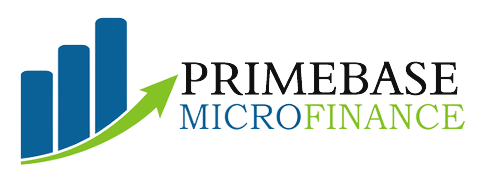

### Technical Test
# PrimeBase Micro Finance Loan Lending Company

Welcome to the PrimeBase Micro Finance Loan Lending Company project! This project demonstrates a simple web application built with React that interacts with the PrimeBase API to manage loan requests and repayment schedules.

Site Demo: [https://primebase-microfinance-app.vercel.app/](https://primebase-microfinance-app.vercel.app/)

---

## Getting Started

To run the project locally, follow these steps:

1. **Clone the Repository**: Clone this repository to your local machine using the following command:

   ```bash
   git clone https://github.com/ezeibekweemma/primebase-microfinance-app.git
   ```

2. **Navigate to the Project Directory**: Move into the project directory:

   ```bash
   cd primebase-microfinance-app
   ```

3. **Install Server Dependencies**: Install the dependencies for the server:

   ```bash
   cd server && npm install
   ```

4. **Server Environment Variable**: Create an `.env` file for the server environment variable:

   ```bash
   vim .env
   ```
- Set up the environment variables by adding the following environment variables to the .env file:
   ```vim
    MONGO_URL=mongodb-url
    CLIENT_URL="http://127.0.0.1:5173"
   ```
   **Note:** Edit the values but don't touch the variable names

5. **Install Client Dependencies** Install the dependencies for the client:

   ```bash
   cd ../client && npm install
   ```

6. **Client Environment Variable**: Create an `.env` file for the client environment variable:

   ```bash
   echo "VITE_API_BASE_URL=http://127.0.0.1:4000/api" > .env
   ```
   
---

## Usage

To start the PrimeBase Micro Finance Application locally, follow these steps:

1. Start the server:

   ```bash
   cd ../server && npm nodemon index.js 
   ```

2. Start the client:

   ```bash
   cd ../client && npm run dev
   ```
3. Access the application in your browser at `http://localhost:5173`.

---

## Features

This project includes the following features:

- Requesting a loan by providing borrower details, loan amount, and repayment duration.
- Displaying a list of all loan requests.
- Fetching the repayment schedule for a specific loan request.

---

## Components

The project is organized into the following React components:

- `RequestLoan.jsx`: Allows users to request a loan by entering borrower details and loan information.
- `AllLoanRequests.jsx`: Displays a list of all loan requests.
- `RepaymentSchedule.jsx`: Fetches and displays the repayment schedule for a specific loan request.

---

## Dependencies

The project uses the following main dependencies:

- React: A JavaScript library for building user interfaces.
- React Router Dom: DOM bindings for React Router.
- Axios: A promise-based HTTP client for making API requests.
- TailwindCSS: A utility-first CSS framework for rapidly building custom user interfaces.
- Heroicons: A set of free MIT-licensed high-quality SVG icons for UI development.

---

## Contributing

Contributions to improve this project are welcome! If you find any issues or want to add new features, please follow these steps:

1. Fork the repository.
2. Create a new branch: `git checkout -b feature/your-feature-name`.
3. Commit your changes: `git commit -m 'Add some feature'`.
4. Push to the branch: `git push origin feature/your-feature-name`.
5. Submit a pull request.

---

## Author
**[Ezeibekwe Emmanuel](https://linkedin.com/in/ezeibekweemma)**
